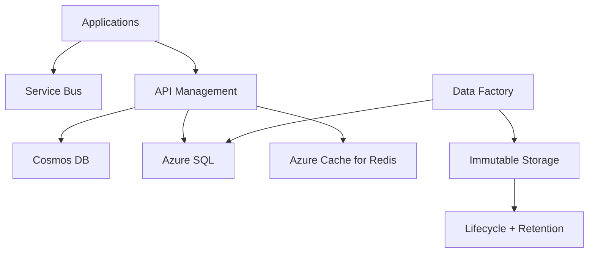

# Data Platform

```mermaid
flowchart TB
  Apps["Applications"] --> ServiceBus["Service Bus"]
  Apps --> Api["API Management"]
  Api --> Cosmos["Cosmos DB"]
  Api --> Sql["Azure SQL"]
  Api --> Redis["Azure Cache for Redis"]
  DataFactory["Data Factory"] --> Storage["Immutable Storage"]
  DataFactory --> Sql
  Storage --> Lifecycle["Lifecycle + Retention"]
```
