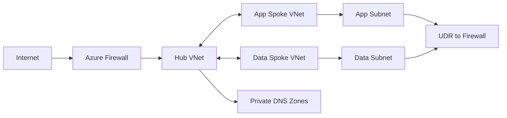

# Hub-Spoke Network

```mermaid
flowchart LR
  Internet["Internet"] --> Firewall["Azure Firewall"]
  Firewall --> Hub["Hub VNet"]
  Hub <--> AppSpoke["App Spoke VNet"]
  Hub <--> DataSpoke["Data Spoke VNet"]
  Hub --> PrivateDns["Private DNS Zones"]
  AppSpoke --> AppSubnet["App Subnet"]
  DataSpoke --> DataSubnet["Data Subnet"]
  AppSubnet --> RouteTable["UDR to Firewall"]
  DataSubnet --> RouteTable
```
