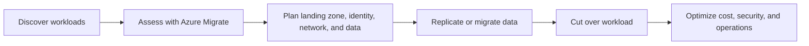

# Migration Path

```mermaid
flowchart LR
  Discover["Discover workloads"] --> Assess["Assess with Azure Migrate"]
  Assess --> Plan["Plan landing zone, identity, network, and data"]
  Plan --> Replicate["Replicate or migrate data"]
  Replicate --> Cutover["Cut over workload"]
  Cutover --> Optimize["Optimize cost, security, and operations"]
```
