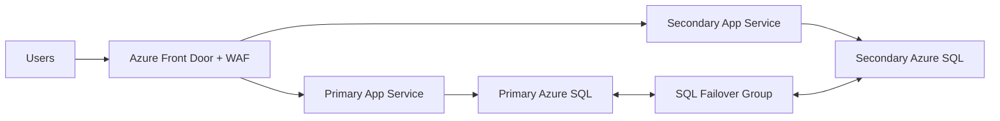

# Multi-Region Front Door

```mermaid
flowchart LR
  Users["Users"] --> FrontDoor["Azure Front Door + WAF"]
  FrontDoor --> PrimaryApp["Primary App Service"]
  FrontDoor --> SecondaryApp["Secondary App Service"]
  PrimaryApp --> PrimarySql["Primary Azure SQL"]
  SecondaryApp --> SecondarySql["Secondary Azure SQL"]
  PrimarySql <--> FailoverGroup["SQL Failover Group"]
  FailoverGroup <--> SecondarySql
```
