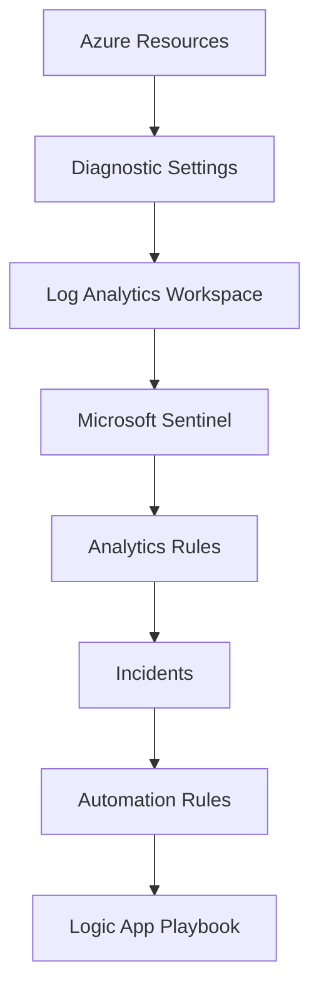

# Sentinel SOC

```mermaid
flowchart TB
  Resources["Azure Resources"] --> Diagnostics["Diagnostic Settings"]
  Diagnostics --> Workspace["Log Analytics Workspace"]
  Workspace --> Sentinel["Microsoft Sentinel"]
  Sentinel --> Analytics["Analytics Rules"]
  Analytics --> Incidents["Incidents"]
  Incidents --> Automation["Automation Rules"]
  Automation --> Playbook["Logic App Playbook"]
```
